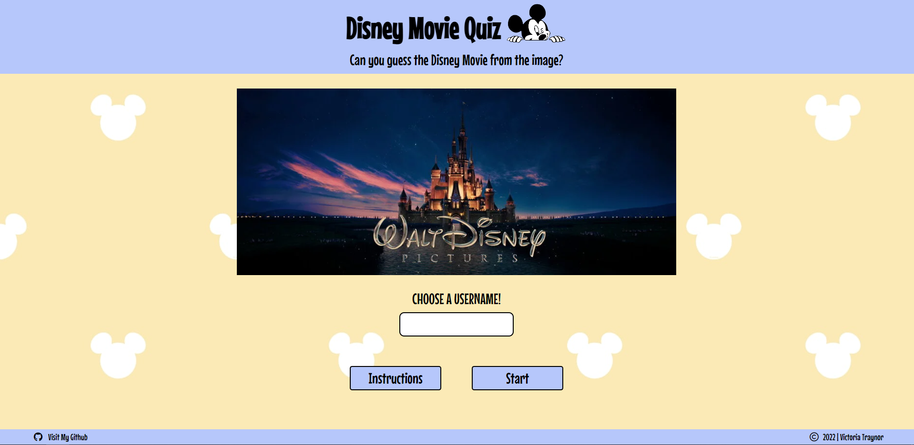
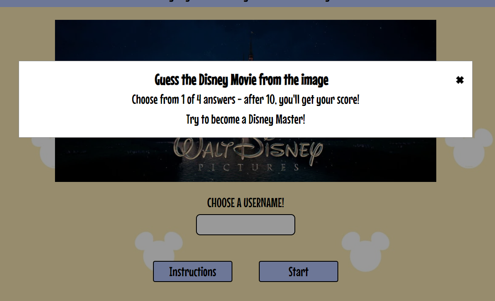
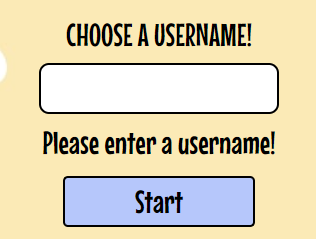
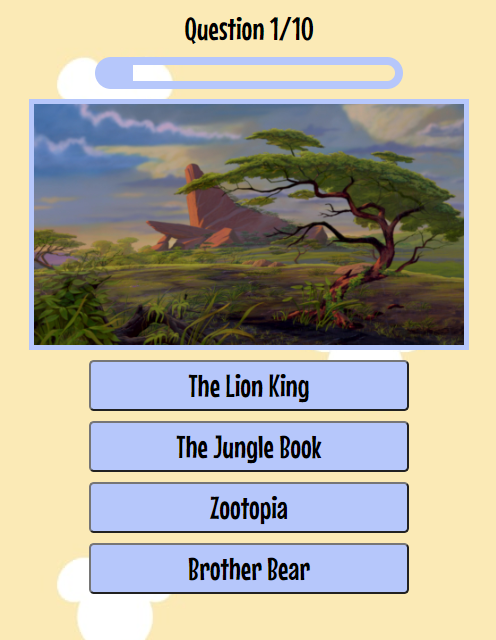
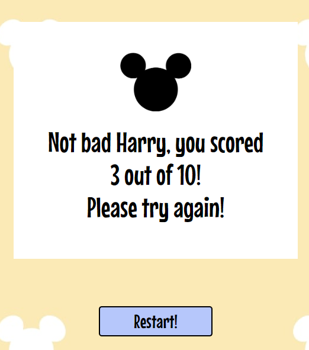
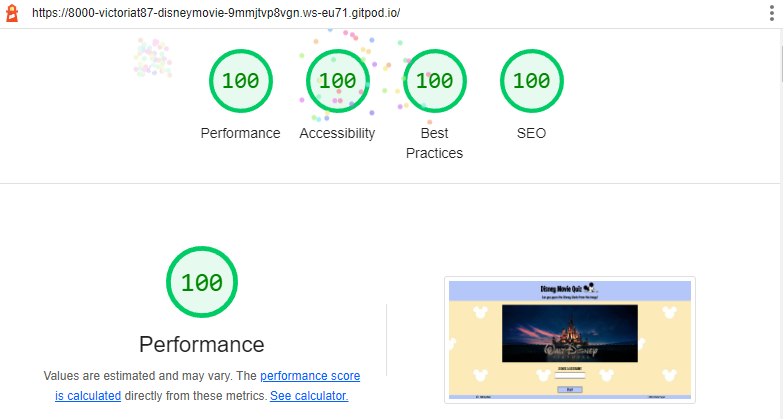
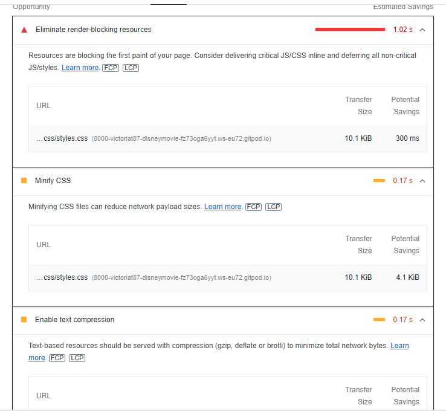
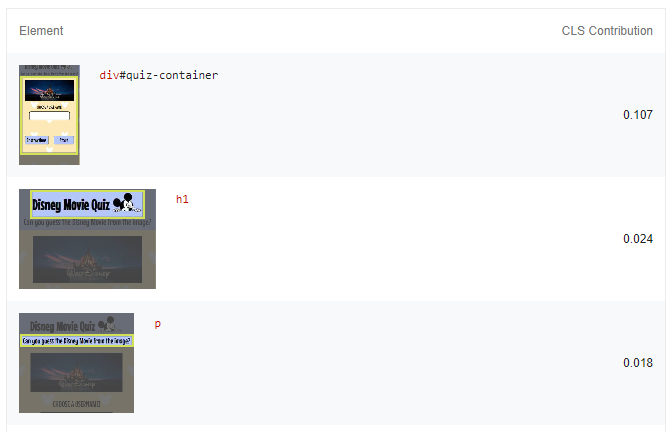

# Disney Movie Quiz

Welcome to the Disney Movie Quiz! This online quiz is built using HTML, CSS and JavaScript. It's designed to test your knowledge of classic animated Disney Movies, so it appeals to all ages, from young to old. Each image and set of answers is generated from JavaScript and your score is calculated and returned on your final results page. Try again if you don't get the Disney Master ending!

[Live link to The Disney Movie Quiz Website](https://victoriat87.github.io/disney-movie-quiz/)

 

# Table of Contents

1. [Features](#features)  
    * [Home Page](#home-page)
    * [Username Validation](#username-validation)
    * [Header and Footer](#header-and-footer)
    * [Quiz Section](#quiz-section)
    * [Progress Bar](#progress-bar)
    * [Quiz Buttons](#quiz-buttons)
    * [Results Section](#results-section)
    * [Features Left To Implement](#features-left-to-implement)
2. [User Experience (UX)](#user-experience-ux)
    * [Site Goals](#site-goals)
    * [User Stories](#user-stories)
    * [Design](#design)
3. [Technologies](#technologies)
    * [Languages Used](#languages-used)
    * [Libraries And Frameworks](#libraries-and-frameworks)
    * [Tools and Resources](#tools-and-resources)
4. [Testing](#testing)
    * [Validator Testing](#validator-testing)
    * [Lighthouse Testing](#lighthouse-testing)
    * [Other Testing](#other-testing)
5. [Bugs Found and Fixed](#bugs-found-and-fixed)
    * [Bugs Not Fixed](#bugs-not-fixed)
6. [Credits And Sources](#credits-and-sources)
7. [Deployment](#deployment)
8. [Acknowledgements](#acknowledgements)

# Features 

## Existing Features

### Home Page

  - The Home Page features a splash image of the Disney Pictures Logo which is instantly recognizable. This will allow visitors to the site to know the quiz is built around Disney Movies.

 - There are 2 buttons on the home page - 1 for instructions and 1 to start the game. The instructions button will open a Modal box, with some text to explain what the quiz is and what the user needs to do.

 

 

[Back to Top](#table-of-contents)

 

### Username Validation
  - On the Index page, there is a username input form. This is validated through JavaScript, and only allows a username between 3 and 8 characters long. It will throw an error is the input field is empty, contains whitespace or is too long.

 

[Back to Top](#table-of-contents)

 

### Header and Footer
  - Across all pages, a header and footer appear. The Header contains a H1 and paragraph, displaying the name of the quiz, as well as a description of what it's about. There is also an image of Mickey Mouse to further show the Disney relation. This header can be clicked by the user to return to the homepage at any time.
  - The Footer contains a link to my Github, with a FontAwesome icon and a copyright.
  - Both the header and footer are within a flexbox, for great responsiveness across all devices and screen sizes.

 

[Back to Top](#table-of-contents)

 

### Quiz Section

  - The Quiz Section will run when the User enters a Username and it's validated.
  - The Quiz contains an image of a classic Disney Movie pulled from an array of questions in script.js, a counter to show which question the user is on, a progress bar (on larger screens) and 4 buttons that are generated purely in JavaScript.
  - The Quiz container is a Flexbox, which allows for great responsiveness, and prevents the quiz from falling out of place when resized. 

 

### Progress Bar
 
 - The progress bar is created through a combination of HTML, CSS and JavaScript. The basic outline is created on the index.html and hid until the quiz is started. With each click on the Next button, the width of the fill on the progress bar increases by 10%, in line with the 10 questions available.
 - The progress bar was built following a tutorial available on [JavaScript.PlainEnglish.io](https://javascript.plainenglish.io/building-a-progress-bar-in-css-js-html-from-scratch-6449da06042)

[Back to Top](#table-of-contents)

 

### Quiz Buttons

 - The Quiz buttons are all generated through JavaScript. The inner text will pull from the question array and display on each button.
 - The buttons have a hover effect, which is a transparency to allow the body background image shine through.

 - When an answer is selected, the correct answer will turn a shade of green and the incorrect ones will turn a shade of red. The selected answer will also highlight with a blue border to match the border of the quiz.

 

[Back to Top](#table-of-contents)

 

### Results Section

  - The Results Section will automatically show when the user has finished answering all 10 questions.
  - The results show as an image and a paragraph with a score marked out of the total questions. The score is calculated through JavaScript and increments each time an answer is selected. There are 3 possible paragraphs of text to return, depending on the score the user received.
  - After the results div, there is a restart button. This reloads the quiz and resets all scores and the username.

 

[Back to Top](#table-of-contents)

 

## Features Left to Implement

- Adding more questions, so there is a larger pool of possible questions and answers to pull from would give the quiz more replayability.
- Give an option to share the quiz and results on social media, to generate more interest in it.
- Adding a timer to each question. This would make sure people weren't cheating by googling the answer.
- Add a random functionality to the answer buttons, so they show in a different place each time.

 

[Back to Top](#table-of-contents)

 

# User Experience (UX)

## Site Goals
The main goal of the website is to encourage visitors, disney fans and movie fans to enjoy a quick quiz on Classic Disney Movies. The images are from movies that released between 1990 and 2020, so the quiz is fun for a large range of ages. The purpose of having different ending result paragraphs is to encourage users to retry the quiz and better their score.

## User Stories

* Users will:

  * Understand that the website is a Disney Movie quiz, based on images.
  * Be able to easily use the website, on desktop and mobile.
  * Return to the home page at any time.
  * Retry the quiz easily once they finish.
  * See their results in an easy to read manner.
  * See the Developers information and GitHub (in an external tab).

 

## Design

### Colour Scheme
 -   The colour scheme was selected once I found a background that suited the fun style of the quiz and linked into Disney. When this was found, I used the [Canva](https://www.canva.com/colors/color-wheel/) website to find complimentary colours based on the pale yellow of the background. This lead me to the pale blue for the header, footer and buttons. Once these were in place, I also used the Canva site to find Analogous colours to match the correct and incorrect colors for each button.

### Typography
 -   The font chosen for the website is a font called Mouse Memoirs. This was picked because it was developed from inspiration of the classic Disney font from the 1950's and 60's. It also has good clarity on both desktop and mobile screens. The font was found on [Google Font](https://fonts.google.com/specimen/Mouse+Memoirs) and imported to the website with a CSS import.

### Wireframe
 - My first step in creating the website was to create a wireframe using [Balsamiq](https://balsamiq.com/). Below is the image.
 

 

[Back to Top](#table-of-contents)

 

# Technologies

## Languages Used
* [HTML5](https://www.w3schools.com/html/)
* [CSS](https://www.w3schools.com/css/)
* [JavaScript](https://www.w3schools.com/js/)

## Libraries And Frameworks
* [Google Fonts](https://fonts.google.com/)
* [Font Awesome](https://fontawesome.com/)

## Tools And Resources
* [GitPod](https://www.gitpod.io/)
* [GitHub](https://github.com/)
* [ReadMe Template](https://github.com/Code-Institute-Solutions/readme-template)
* [PicResize](https://picresize.com/)
* [Balsamiq](https://balsamiq.com/)
* [WEBP Converter](https://cloudconvert.com/webp-converter)
* [Am I Responsive](https://ui.dev/amiresponsive)
* [W3C HTML Validation](https://validator.w3.org/)
* [W3C CSS Validation](https://jigsaw.w3.org/css-validator/)
* [JSHint](https://jshint.com/)
* [Lighthouse](https://web.dev/measure/)
* [Chrome DevTools](https://developer.chrome.com/docs/devtools/)
* [Flexbox](https://css-tricks.com/snippets/css/a-guide-to-flexbox/)
* [Stack Overflow](https://stackoverflow.com/)
* [Favicon.io](https://favicon.io/)
* [Responsive Design Checker](https://responsivedesignchecker.com/)

 

[Back to Top](#table-of-contents)

 

# Testing 
### Validator Testing 

- HTML
  - No errors were returned when passing through the official [W3C validator](https://validator.w3.org/)
- CSS
  - No errors were found when passing through the official [(Jigsaw) validator](https://jigsaw.w3.org/css-validator/)
- JavaScript
  - No errors were returned when passing through [JSHint](https://jshint.com/)

* Metrics Returned:

    * There are 18 functions in this file.

    * Function with the largest signature take 2 arguments, while the median is 0.

    * Largest function has 11 statements in it, while the median is 2.5.

    * The most complex function has a cyclomatic complexity value of 4 while the median is 1.

    * 34 Warnings appear but are all the following:
    	- 'const' is available in ES6 (use 'esversion: 6') or Mozilla JS extensions (use moz).
      - 'let' is available in ES6 (use 'esversion: 6') or Mozilla JS extensions (use moz).
      - 'arrow function syntax (=>)' is only available in ES6 (use 'esversion: 6').
      -	'template literal syntax' is only available in ES6 (use 'esversion: 6').

    * When JSHint is configured to show "New JavaScript features (ES6)", there are no more warnings.

Other Warnings included;
* Missing Semicolons - these were all corrected.

* Undefined Variables - these were removed as all were found to be unnecessary to the functions.

### Lighthouse Testing
 - When tested on desktop, the website scores 100 across all categories. 
  
  

 - On mobile, the performace is 96. This is because of a cumulative layout shift of 0.154. Recommendations for this were to add width and height to images and change the images to .webp format.
 - To change images from .jpg to .webp I used the website [WEBP Converter](https://cloudconvert.com/webp-converter).
 - Even after these changes, there is still a CLS of 0.154. As I have already given everything a max-width and height, this is the best I can achieve.
 - I also received a red warning for First Contentful Paint. The warning was telling me to "Eliminate render-blocking resources". After googling this issure, I found this website [LogRocket.com](https://blog.logrocket.com/9-tricks-eliminate-render-blocking-resources/#load-custom-fonts-locally) and after reading, felt my best option to reduce this was to load the styles.css file in the header of the index.html page, instead of using the @import method in styles.css. This fixed the issue. 

| Page | Device | Category | Result |
|------|--------|----------|--------|
|Index | Mobile | Performance | 96% |
|||Accessibility| 100% |
|||Best Practice | 100% |
|||SEO | 100% |
|| Desktop | Performance | 100% |
||| Accessibility | 100% |
||| Best Practice | 100% |
||| SEO | 100% |
  

### Other Testing
 - The website has been tested across various screen sizes, using the Chrome DevTools responsive device section, [Responsive Design Checker](https://responsivedesignchecker.com/) and by opening the website on Firefox, Chrome, 3 various sized Android phones (Huawei P20 Lite, OnePlus 9 Pro, Samsung Galaxy S20) and an Android tablet (Samsung Galaxy Tab 10). 
 - [Markdown file of device screenshots](assets/documentation/tested-devices.md)

  

[Back to Top](#table-of-contents)

 

# Bugs Found and Fixed
 - Originally, the buttons on the quiz weren't disabled, so someone could click the correct answer an infinite amount of times and each time the score would add +1. This meant someone could finish the quiz with a score of 1000/10. To fix this, I implemented some code to disable the buttons once one was clicked. "button.disabled = true;", found on [Alvarotrigo.com](https://alvarotrigo.com/blog/disable-button-javascript/).
 - I also didn't have code in place originally to validate the username properly. Usernames could be an infinite amount of characters and could be entered with just 4 spaces. Upon researching this, I found the .trim() method could be used to remove whitespace - [W3 Schools](https://www.w3schools.com/jsref/jsref_trim_string.asp) - and I added code for limit the username length ('(username.length <= Number(2))').
 - My question counter wasn't working at first, or would only count to 9 when I set it to be equal to the length of my questions. After discussing this with a fellow student [Sean Johnson](https://seanj06.github.io/), I realised it was because I had written my currentQuestion++ code inside the "nextQuestion" function and it was therefore only being called after the original question loaded. The currentQuestion++ was added to the click Event Listener and this solved my problem.
 - I had declared the username as a const originally which caused an error as it wasn't editable, so was changed to "let". I then had an issue where it would call write [object HTMLInputElement] to the results div when used in a template literal. Upon researching, I realised I needed to call the .value of the username input field and this fixed the issue.
 - I wanted to disable hover effects on mobile, as this was causing mobile users to have to click the start and restart button twice to actually work. Having looked at [Stack Overflow](https://stackoverflow.com/questions/23885255/how-to-remove-ignore-hover-css-style-on-touch-devices) for a solution, I originally tried to use the JavaScript function watchForHover(). This seemed to work on my own personal device, but when tested on different mobile screens, it didn't. I removed this code and instead used the other solution on that thread which was a media rule "@media (hover: hover) and (pointer: fine)" and this has worked.
 

# Bugs Not Fixed
 - Although not necessarily a bug, I did discover that the shuffle method I was using was not recommended as it is "inefficient and strongly biased" according the my research. I tried to implement the The Fisher-Yates algorithim but couldn't get it to work with my array. It seemed to be more based on a straight array of "arr=[1,2,3,4]", rather than a more complex one with questions and answers. I left my original shuffle method in as I know it works and my array isn't too big for the shuffle order to be noticably favoured to certain questions.

 

[Back to Top](#table-of-contents)

 

# Credits and Sources

- The basic quiz logic of creating buttons and colouring them was built using the code-along tutorial from [Web Dev Simplified](https://www.youtube.com/watch?v=riDzcEQbX6k)
- All quiz images were found on [Animation Screencaps](https://animationscreencaps.com/)
- The Disney Logo is from [Yuco.com](https://www.yuco.com/works/disney)
- The Mickey Mouse image in the header was found on [Pngwing.com](https://www.pngwing.com/en/free-png-avcmk)
- The outline of Mickey Mouse used in the Results section and as the FavIcon is from [Pngwing.com](https://www.pngwing.com/en/free-png-mfqez)
- The progress bar is built using code from [Javascript.plainenglish.io](https://javascript.plainenglish.io/building-a-progress-bar-in-css-js-html-from-scratch-6449da06042)
- Validating the form data was from the Love Maths Project on [Code Institute](https://github.com/Code-Institute-Solutions/love-maths-2.0-sourcecode) and the trim method to remove whitespace was found at [W3 Schools](https://www.w3schools.com/jsref/jsref_trim_string.asp)
- The body background image was found at [WallpaperAccess.com](https://wallpaperaccess.com/mickey-mouse-head-pattern)
- The restart function was found on [LearnersBucket.com](https://learnersbucket.com/examples/javascript/different-ways-to-reload-refresh-page-in-javascript/)
- The code to disable a hover effect on mobile was found on [Stack Overflow](https://stackoverflow.com/questions/2754546/can-i-disable-a-css-hover-effect-via-javascript)
- Disabling a button after clicked was built using code found on [Alvarotrigo.com](https://alvarotrigo.com/blog/disable-button-javascript/)
- Code to create a modal instructions box was found on [W3 Schools](https://www.w3schools.com/howto/howto_css_modals.asp)
 

[Back to Top](#table-of-contents)

 

# Deployment

The following are the steps I went through to deploy my live site:

- The site was deployed to GitHub pages. The steps to deploy are as follows: 
  - In the GitHub repository, navigate to the Settings tab on the top menu.
  - From the settings page, navigate to the Pages section from the left hand side menu.
  - From the source section drop-down menu, select "Deploy From a Branch"
  - Press the save button.
  - After a few minutes, you can refresh the page to see your Live Site link at the top.

- To Fork the repository:
  - On GitHub.com, navigate to the repository.
  - In the top-right corner of the page, click Fork.
  - Select an owner for the forked repository.
  - By default, forks are named the same as their parent repositories. You can change the name of the fork to distinguish it further.
  - Optionally, add a description of your fork.
  - Choose whether to copy only the default branch or all branches to the new fork.
  - Click Create fork.

- To Clone the repository:
  - On GitHub.com, navigate to the repository.
  - Above the list of files, click the Code button.
  - Copy the URL for the repository.
  - Open Git Bash.
  - Change the current working directory to the location where you want the cloned directory.
  - Type git clone, and then paste the URL you copied earlier.
  - Press Enter. Your local clone will be created.

 
The live link can be found here - https://victoriat87.github.io/disney-movie-quiz/

 

[Back to Top](#table-of-contents)

 

# Acknowledgements
- To my amazing boyfriend Thomas. For listening to me worry about this project for months, for keeping me sane, for helping me switch off after a long day with a cup of coffee and a bar of chocolate :)
- My family and my cats for keeping my stress levels under control!
- My Mentor [Jubril Akolade](https://github.com/Jubrillionaire) for all the help. His guidance was invaluable.
- Sean Finn and Sean Johnston, my fellow classmates on Slack. Your help with my many questions was super appreciated, thank you.

 

[Back to Top](#table-of-contents)